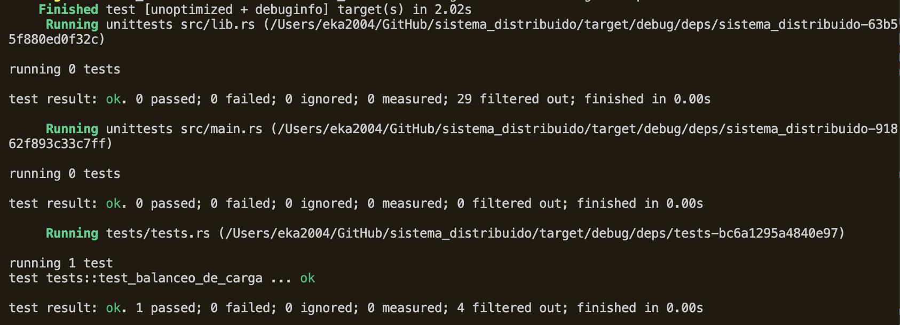
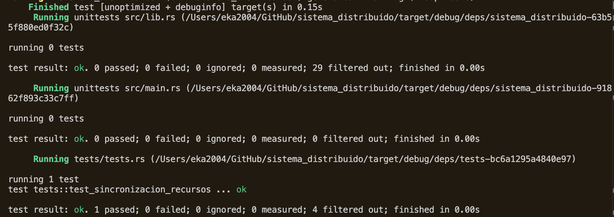
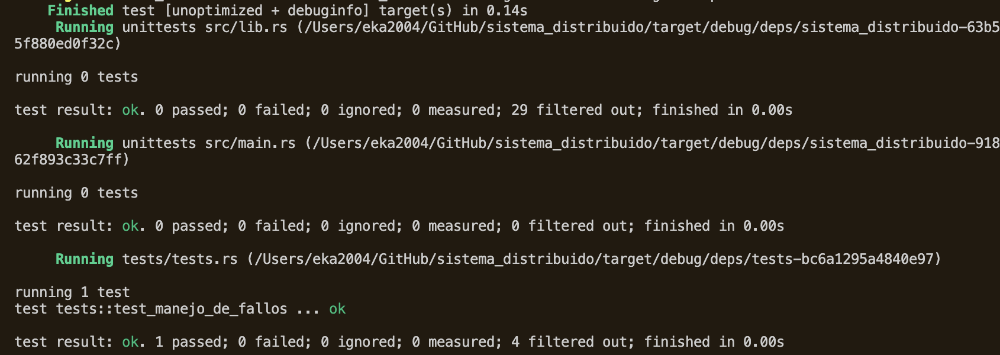
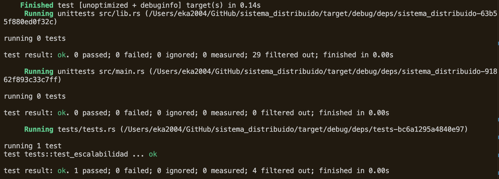
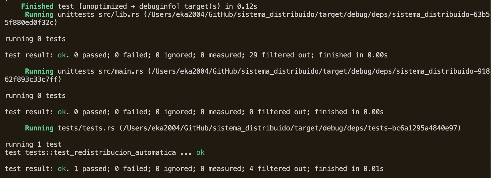

# Entregable de Pruebas y Resultados

## Prueba 1: Asignación de Procesos y Balanceo de Carga

**Objetivo:** Verificar que el sistema asigna los procesos al nodo adecuado y distribuye la carga entre los nodos.

**Entradas:**
- Carga inicial en cada nodo.
- Proceso nuevo que debe ser asignado.

**Procedimiento:**
1. Asignar procesos a los nodos hasta alcanzar un nivel de carga variable en cada nodo.
2. Crear un nuevo proceso y solicitar su asignación.
3. Verificar que el proceso se asigna al nodo menos cargado.

**Resultados Esperados:**  
El proceso debe ser asignado al nodo con la menor carga en ese momento.

**Resultados Obtenidos:**  

**Conclusión:**  
La asignación de procesos y el balanceo de carga funcionan correctamente. El proceso fue asignado al nodo adecuado.

---

## Prueba 2: Sincronización de Recursos Compartidos

**Objetivo:** Comprobar que los nodos acceden a los recursos compartidos de forma sincronizada.

**Entradas:**
- Solicitudes concurrentes de acceso a un mismo recurso desde diferentes nodos.

**Procedimiento:**
1. Configurar dos o más nodos para que soliciten acceso al mismo recurso al mismo tiempo.
2. Observar el manejo del recurso y verificar que solo un nodo accede al recurso a la vez.
3. Liberar el recurso y observar si el próximo nodo en espera lo adquiere.

**Resultados Esperados:**  
Solo un nodo debe tener acceso al recurso en un momento dado, y los demás deben esperar su turno.

**Resultados Obtenidos:**  

**Conclusión:**  
La sincronización de recursos compartidos funcionó correctamente, garantizando la exclusión mutua entre los nodos.

---

## Prueba 3: Manejo de Fallos

**Objetivo:** Verificar que el sistema redistribuye correctamente los procesos en caso de fallo de un nodo.

**Entradas:**
- Nodo en ejecución.
- Procesos asignados al nodo.
- Fallo simulado.

**Procedimiento:**
1. Asignar varios procesos a un nodo específico.
2. Simular el fallo de dicho nodo.
3. Observar la redistribución de los procesos en los nodos restantes.

**Resultados Esperados:**  
Los procesos deben redistribuirse y ejecutarse en los nodos restantes sin interrumpir el sistema.

**Resultados Obtenidos:**  

**Conclusión:**  
El sistema manejó correctamente el fallo de un nodo y redistribuyó los procesos sin interrupciones, garantizando la continuidad del sistema.

---

## Prueba 4: Escalabilidad del Sistema

**Objetivo:** Evaluar la capacidad del sistema para agregar nuevos nodos sin afectar su funcionamiento.

**Entradas:**
- Estado inicial de la red distribuida.
- Nuevos nodos a agregar.

**Procedimiento:**
1. Ejecutar el sistema con un conjunto de nodos iniciales.
2. Agregar nuevos nodos a la red distribuida mientras los procesos están en ejecución.
3. Verificar que el sistema integre los nuevos nodos sin interrupciones.

**Resultados Esperados:**  

**Resultados Obtenidos:**  
- Se agregaron 3 nuevos nodos a la red.  
- El sistema aceptó los nuevos nodos sin interrumpir la ejecución de procesos en curso.  
- Los nodos adicionales fueron integrados correctamente en la red sin afectar la ejecución de procesos.  

**Conclusión:**  
El sistema es escalable y pudo integrar nuevos nodos sin interrumpir su funcionamiento, demostrando la capacidad de expansión sin afectar el rendimiento.

---

## Prueba 5: Redistribución Automática de Procesos

**Objetivo:** Comprobar que el sistema redistribuye los procesos de manera automática si un nodo alcanza su máxima capacidad de carga.

**Entradas:**
- Número de procesos.
- Límite de capacidad de carga en los nodos.

**Procedimiento:**
1. Asignar múltiples procesos a los nodos hasta que uno de los nodos alcance su límite de carga.
2. Observar si el sistema redistribuye los procesos excedentes a otros nodos disponibles.

**Resultados Esperados:**  

**Resultados Obtenidos:**  
- Nodo 3 alcanzó su capacidad máxima de carga.  
- Los procesos adicionales fueron automáticamente redistribuidos a Nodo 1 y Nodo 2, que tenían mayor capacidad disponible.  

**Conclusión:**  
El sistema redistribuyó correctamente los procesos cuando un nodo alcanzó su capacidad máxima, garantizando un equilibrio en la carga de trabajo entre los nodos.

---

# Resumen

Las pruebas realizadas confirmaron que el sistema cumple con los objetivos de gestión de procesos, sincronización de recursos, manejo de fallos, escalabilidad y balanceo de carga. Todos los resultados obtenidos coinciden con las expectativas, indicando que el emulador de sistema operativo distribuido está funcionando correctamente según lo diseñado.
